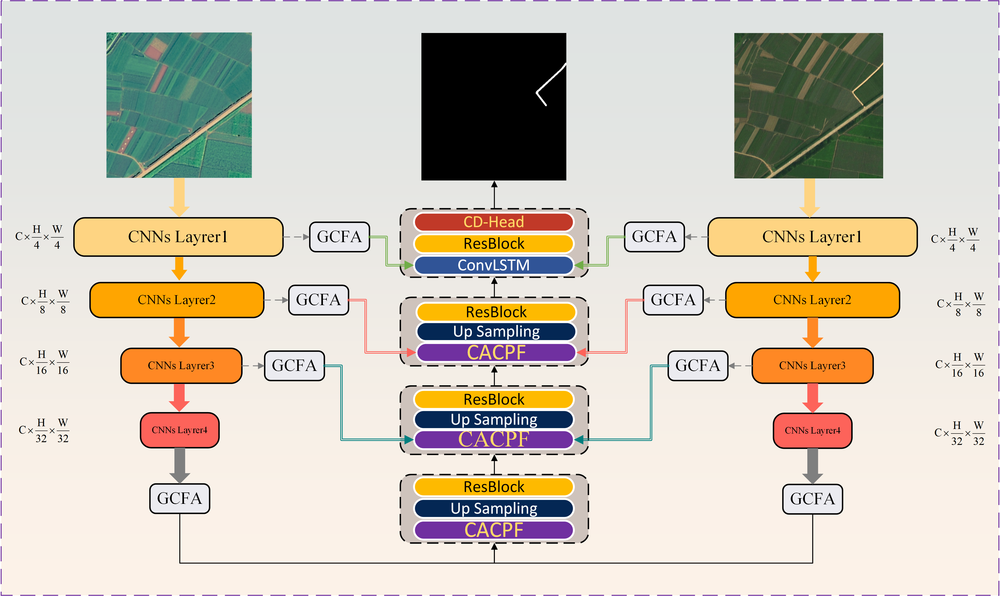

# CMCD: a cropland mask-guided remote sensing change detection framework for suppressing pseudo changes

## :evergreen_tree: Overview

- **Research Background**：Agricultural production serves as the bedrock of global food security and relies fundamentally on the quantity and quality of cropland resources. The increasingly severe conversion of cropland to non-agricultural uses demands urgent intervention. Remote sensing imagery enables accurate land monitoring and provides a scientific foundation for detecting cropland loss.
- **Technical route**：To the best of our knowledge, this study marks the first effort to integrate cropland mask-guided spatial attention, multi-level feature enhancement, and boundary refinement strategies from dual‑temporal remote sensing imagery—for accurate cropland change detection. Through a mask-guided self‑supervised learning mechanism, the proposed approach enables, for the first time, precise detection of cropland changes in complex backgrounds and high‑interference scenarios (e.g., seasonal pseudo‑changes, non‑agricultural land interference). We validate CMCD on multiple cropland change detection datasets, and the results demonstrate that the proposed framework achieves high‑precision cropland change detection with robust suppression of false positives.
 
## :bar_chart: Model test dataset
| **Dataset**         | Dataset download |
| :------------------ | :--------------------- |
| **Public generalization(CLCD)** | [dataset](https://github.com/liumency/CropLand-CD)  |
| **Public generalization(PX-CLCD)** | [dataset](https://github.com/niuzhan/Peixian-Cultivated-land-Change-detection-dataset) |
| **Public generalization(LEVIR-CD)** | [dataset](https://opendatalab.org.cn/OpenDataLab/LEVIR-CD)   |

## :fallen_leaf: Visualization
<details open>
  <div align="center">
    < img src="result/可视化-CLCD.png" width="80%">
  </div>
   <div align="center">
    < img src="result/可视化-PXCLCD.png" width="80%">
  </div>
</details>

## :computer: Installation
<details open>
  <summary>Dependency installation steps</summary>
  
  1. **Clone this project and create a conda environment:**
     ```bash
     git clone https://github.com/TechJots-Liu/CF-SCSNet.git
     cd CF-SCSNet
     
     conda create -n cf_scsnet python=3.10.9
     conda activate cf_scsnet
  2. **Install pytorch and torchvision matching your CUDA version:**
     ```bash
     pip install torch==1.13.1+cu117 torchvision==0.14.1+cu117 torchaudio==0.13.1 --extra-index-url https://download.pytorch.org/whl/cu117
  3. **Install requirements:**
     ```bash
     pip install -r requirements.txt
  4. **Load the Roberta word encoder locally**
     [Roberta-base](https://huggingface.co/FacebookAI/roberta-base)
