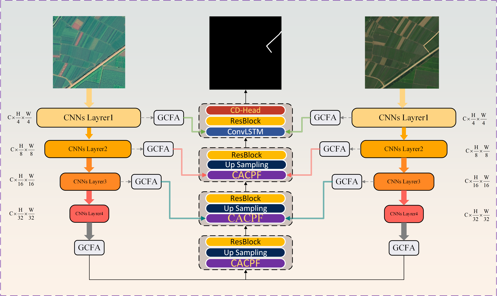

# GMCD: A generative mask-guided framework for farmland change detection under seasonal variations

## :evergreen_tree: Overview

## Introduction
Accurate detection of farmland changes from bi-temporal remote sensing imagery is challenging. Seasonal phenological variations produce substantial pseudo changes, while non-farmland objects with farmland-like appearance introduce extra false detections. To tackle these issues, we propose a generative mask-guided framework for farmland change detection, which embeds farmland-specific spatial priors into the change detection pipeline.
The framework first generates farmland probability masks from encoded bi-temporal images. These masks adaptively enhance farmland-related features and suppress non-farmland interference. We further design a cross-temporal attention-convolutional pyramid fusion module to model temporal correspondence and selectively highlight discriminative change information at multiple scales. The model is jointly optimized by three loss terms: primary change detection loss, farmland mask loss, and cross-temporal consistency loss.
Experiments on CLCD and PX-CLCD datasets show that our method achieves F1-scores of 78.06% and 96.48%, outperforming the best competitors by 0.53% and 1.42%. The corresponding IoUs are 64.02% and 93.20%, with gains of 1.01% and 2.61%. Qualitative and feature-level analyses verify that the mask-guided mechanism reduces false detections caused by seasonal variations and complex non-farmland backgrounds. Additional experiments on LEVIR-CD building change detection dataset demonstrate the generalization capability of our architecture.
 
## :bar_chart: Model test dataset
| **Dataset**         | Dataset download |
| :------------------ | :--------------------- |
| **Public generalization(CLCD)** | [dataset](https://github.com/liumency/CropLand-CD)  |
| **Public generalization(PX-CLCD)** | [dataset](https://github.com/niuzhan/Peixian-Cultivated-land-Change-detection-dataset) |
| **Public generalization(LEVIR-CD)** | [dataset](https://opendatalab.org.cn/OpenDataLab/LEVIR-CD)   |

## :fallen_leaf: Visualization
<details open>
<div align="center">
  
  <br>
  
</div>

## :computer: Installation
<details open>
  <summary>Dependency installation steps</summary>
  
  1. **Clone this project and create a conda environment:**
     ```bash
     git clone https://github.com/HYFreedom/ChangeDetection.git
     cd GMCD
     
     conda create -n cmcd python=3.10.9
     conda activate cmcd
  2. **Install pytorch and torchvision matching your CUDA version:**
     ```bash
     pip install torch==1.13.1+cu117 torchvision==0.14.1+cu117 torchaudio==0.13.1 --extra-index-url https://download.pytorch.org/whl/cu117
  3. **Install requirements:**
     ```bash
     pip install -r requirements.txt

